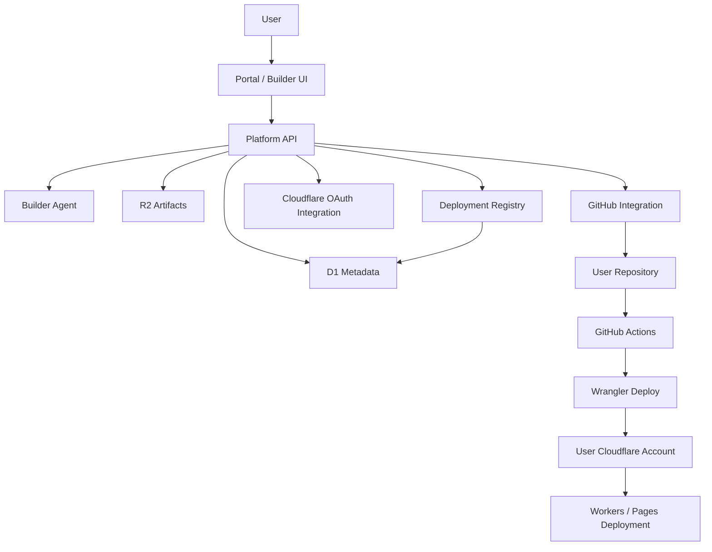

# Architecture Spec V5: GitHub Actions + User Cloudflare Account

**وضعیت:** Proposed  
**هدف:** تعریف معماری v5 برای محصول Nexus با این رویکرد:

- `Control Plane` روی پلتفرم ما
- `Source of Truth` روی GitHub
- `Build/Deploy` با GitHub Actions
- `Free Tier Runtime` روی Cloudflare account خود کاربر
- بدون `Sandbox SDK` و بدون `WebContainers` در v1

---

## 1. خلاصه تصمیم

در v5 ما به‌جای اینکه preview/build/runtime را داخل sandboxهای خودمان اجرا کنیم، مسیر زیر را مبنا قرار می‌دهیم:

1. کاربر با agent یا builder تعامل می‌کند
2. پلتفرم فایل‌ها و تغییرات پروژه را تولید می‌کند
3. تغییرات در repository کاربر روی GitHub ثبت می‌شوند
4. `GitHub Actions` build/test/deploy را اجرا می‌کند
5. deployment نهایی روی `Cloudflare account` خود کاربر انجام می‌شود

این مدل برای `free tier` بهترین تعادل را بین:

- هزینه
- سادگی
- realism
- production parity
- و قابلیت جذب کاربر

ایجاد می‌کند.

---

## 2. چرا V5؟

V5 عمداً از این اجزا **استفاده نمی‌کند**:

- `Sandbox SDK`
- `Containers`
- `WebContainers`

نه به این دلیل که این ابزارها بد هستند، بلکه چون برای v1 محصول ما:

- complexity را بالا می‌برند
- دو execution model تولید می‌کنند
- source of truth را مبهم می‌کنند
- و هزینه یا ambiguity عملیاتی ایجاد می‌کنند

V5 می‌گوید:

**اگر پروژه می‌خواهد واقعی و production-oriented باشد، باید build و deploy از مسیر واقعی CI/CD عبور کند.**

---

## 3. اصول معماری V5

1. **GitHub منبع حقیقت کد است**
2. **Cloudflare account کاربر مقصد deploy در پلن رایگان است**
3. **پلتفرم ما فقط control plane و orchestration را نگه می‌دارد**
4. **build باید reproducible و CI-backed باشد**
5. **preview در v1 می‌تواند branch/staging deploy باشد، نه sandbox live preview**
6. **upgrade به پلن پولی نباید source model را بشکند**

---

## 4. Scope نسخه V5

### داخل Scope

- AI builder
- template-based app generation
- GitHub repo integration
- Cloudflare OAuth integration
- GitHub Actions build/deploy
- deploy به `Workers` یا `Pages` روی account کاربر
- deployment history
- app metadata و environment mapping

### خارج از Scope

- cloud sandbox execution
- local browser execution runtime
- arbitrary code execution
- multi-runtime build farm
- managed `Workers for Platforms` hosting برای free tier
- white-label domain automation در free tier

---

## 5. معماری منطقی

---

## 6. اجزای اصلی سیستم

### 6.1 Portal

Portal مسئول این بخش‌هاست:

- chat/builder UI
- project settings
- deployment status
- GitHub connect flow
- Cloudflare connect flow
- branch/deployment history

تکنولوژی پیشنهادی:

- `SvelteKit`
- deploy روی `Workers`

### 6.2 Platform API

این لایه قلب control plane است و باید این مسئولیت‌ها را داشته باشد:

- auth/session
- tenant context
- app metadata CRUD
- integration state management
- orchestration برای generate, commit, deploy
- webhook handling از GitHub
- deployment state transitions

تکنولوژی پیشنهادی:

- `TypeScript Workers`
- `D1` + `R2`

### 6.3 Builder Agent

Agent مسئول تولید و اصلاح پروژه است، نه build/runtime.

وظایف:

- تحلیل prompt
- انتخاب template
- تولید file tree
- تولید patchها
- توضیح خطاهای CI
- اصلاح کد بعد از خطای build

چیزی که Agent **نباید** در v1 انجام دهد:

- اجرای shell command واقعی
- اجرای arbitrary code
- نگه‌داری runtime sandbox

### 6.4 GitHub Integration

GitHub در V5 فقط یک integration جانبی نیست؛ source of truth کل محصول است.

کاربردها:

- repository creation/connect
- branch strategy
- commit/push changes
- trigger workflow
- read build logs/status
- PR or preview branch management

### 6.5 Cloudflare OAuth Integration

Cloudflare OAuth برای این است که کاربر:

- account خودش را authorize کند
- scope محدود برای deploy بدهد
- بعداً revoke کند

این integration باید account-level و tenant-aware باشد.

### 6.6 GitHub Actions

GitHub Actions در V5 نقش `execution plane` را دارد:

- install dependencies
- lint
- test
- build
- `wrangler deploy`

CI باید canonical build environment باشد.

### 6.7 D1

`D1` برای metadata است:

- users
- tenants
- apps
- repositories
- cloudflare_accounts
- deployments
- workflow_runs
- integration_tokens_metadata

### 6.8 R2

`R2` برای artifactها و snapshotهاست:

- generated file snapshots
- deployment manifests
- imported templates
- summarized logs
- build artifacts references

---

## 7. Trust Boundaries

V5 به‌صورت عمدی trust boundaryها را شفاف می‌کند.

### Boundary A: Platform-Controlled

روی زیرساخت ما:

- Portal
- Platform API
- Agent runtime
- metadata
- orchestration state

### Boundary B: User-Controlled GitHub

روی GitHub user:

- repository
- workflow definitions
- action runs
- code history

### Boundary C: User-Controlled Cloudflare

روی Cloudflare user:

- Workers / Pages project
- deployed versions
- quotas
- limits
- route/domain ownership

این تفکیک باعث می‌شود:

- free tier sustainable باشد
- support model شفاف شود
- blame surface قابل‌فهم بماند

---

## 8. Source of Truth

### 8.1 Code Source of Truth

**GitHub repo**

نه browser state، نه draft memory، نه generated snapshot.

### 8.2 Metadata Source of Truth

**D1**

برای:

- app identity
- tenant binding
- repo binding
- Cloudflare account binding
- deployment states

### 8.3 Deployment Truth

**Cloudflare deployment on user account**

آنچه در production بالا آمده، truth نهایی runtime است.

---

## 9. هویت و اتصال‌ها

### 9.1 User Identity

کاربر وارد Nexus می‌شود و identity داخلی خودش را دارد.

### 9.2 GitHub Identity

کاربر GitHub را وصل می‌کند تا:

- repo بسازد یا repo موجود را متصل کند
- push/commit انجام شود
- workflow status خوانده شود

### 9.3 Cloudflare Identity

کاربر Cloudflare را از طریق OAuth وصل می‌کند تا:

- account target انتخاب شود
- scopes موردنیاز approve شوند
- deploy روی account خودش انجام شود

---

## 10. مدل داده پیشنهادی

### جداول اصلی D1

- `users`
- `tenants`
- `memberships`
- `apps`
- `app_templates`
- `repositories`
- `cloudflare_accounts`
- `cloudflare_authorizations`
- `deployments`
- `deployment_runs`
- `build_failures`
- `artifacts`

### توضیح entityها

#### `apps`

- app id
- tenant id
- name
- template type
- current branch
- current deployment id
- status

#### `repositories`

- provider = `github`
- owner
- repo name
- default branch
- installation/app metadata

#### `cloudflare_accounts`

- provider user id
- cloudflare account id
- account name
- allowed scopes
- authorization status

#### `deployments`

- app id
- git commit sha
- git branch
- target environment
- cloudflare account id
- deploy status
- deployed worker/pages id

---

## 11. محیط‌ها

### 11.1 Draft

- app exists in metadata
- code changes may exist in feature branch
- no public deployment guaranteed

### 11.2 Preview

- preview deploy via CI on non-production branch
- may map to branch alias or preview worker version

### 11.3 Production

- successful deployment on selected branch/tag
- active on user Cloudflare account

---

## 12. Deploy Flow اصلی

### 12.1 Initial Connect Flow

1. user signs in to Nexus
2. user connects GitHub
3. user connects Cloudflare
4. user selects GitHub repo or creates one
5. user selects Cloudflare account target
6. platform stores metadata bindings in `D1`

### 12.2 Create App Flow

1. user chooses template
2. user describes app
3. builder agent produces initial files
4. platform commits generated files to target repo
5. GitHub Actions workflow runs
6. workflow builds and deploys to user Cloudflare account
7. deployment result is written back to platform

### 12.3 Update App Flow

1. user requests a change
2. agent prepares patch
3. patch is committed to repo branch
4. CI runs
5. if build passes, deployment is updated
6. if build fails, failure summary is stored and exposed to agent/user

---

## 13. GitHub Actions در V5

### نقش

GitHub Actions فقط CI نیست؛ runtime build engine رسمی سیستم است.

### وظایف

- install
- typecheck
- lint
- unit test
- build
- wrangler deploy

### اصل طراحی

هر deployment باید از داخل CI انجام شود، نه از browser و نه از platform worker.

این باعث می‌شود:

- auditability
- repeatability
- deterministic builds
- easier debugging

تقویت شوند.

---

## 14. Wrangler Deploy Model

مدل پیشنهادی:

- workflow در GitHub repo کاربر اجرا می‌شود
- deploy command از `wrangler deploy` یا `wrangler pages deploy` استفاده می‌کند
- credentials از Cloudflare authorization قابل استفاده می‌شوند

دو الگوی ممکن:

### Pattern A: User-Owned Secrets in GitHub

کاربر secretها را داخل GitHub repository خودش می‌گذارد.

مزایا:

- platform secret custody کمتر
- trust ساده‌تر

معایب:

- onboarding friction بیشتر

### Pattern B: Platform-Managed Deploy Trigger

پلتفرم با access delegation یا token exchange مسیر deploy را orchestrate می‌کند.

مزایا:

- UX بهتر

معایب:

- secret/token custody پیچیده‌تر
- security burden بیشتر

### پیشنهاد V5

برای v1:

- **Pattern A**

چون:

- ساده‌تر است
- audit واضح‌تر است
- کم‌ریسک‌تر است

---

## 15. OAuth Strategy

### 15.1 Cloudflare OAuth

هدف:

- دسترسی محدود برای deploy
- account selection by user
- revocable consent

### 15.2 Scope Principle

فقط حداقل scope لازم گرفته شود:

- read account metadata
- deploy worker/pages
- manage needed routes/assets only when necessary

### 15.3 Revocation

کاربر باید بتواند:

- Cloudflare authorization را revoke کند
- GitHub integration را disconnect کند

### 15.4 Failure Handling

اگر authorization از بین رفت:

- app metadata باقی بماند
- deployment status به `authorization_required` برود
- user برای reconnect هدایت شود

---

## 16. Preview Strategy در V5

چون `Sandbox` و `WebContainers` حذف شده‌اند، preview باید CI-backed باشد.

### مدل پیشنهادی

- branch-based preview
- preview deployment per branch
- preview URL after successful build

### مزایا

- نزدیک به production
- reproducible
- no browser runtime dependency

### معایب

- کندتر از live sandbox preview
- interaction loop طولانی‌تر

### راهکارهای کاهش کندی

- templateهای سبک
- dependency caching
- smaller workflows
- branch preview reuse

---

## 17. Error Recovery Loop

در V5 خطاها از CI برمی‌گردند، نه از runtime sandbox.

### Flow

1. workflow fails
2. logs are collected
3. platform summarizes failure
4. agent receives structured failure context
5. agent proposes patch
6. patch is committed
7. workflow reruns

این loop برای v1 کافی است و نیازی به shell-level debug interactive ندارد.

---

## 18. Free Tier Product Model

### کاربر free چه می‌گیرد؟

- builder access
- limited templates
- GitHub integration
- Cloudflare account deploy
- branch-based preview
- production deploy on own account

### کاربر free چه نمی‌گیرد؟

- managed preview sandbox
- managed hosting on our account
- custom domain management by platform
- rollback management
- hosted secrets management
- advanced team collaboration

---

## 19. Upgrade Path به پلن پولی

V5 باید از روز اول طوری طراحی شود که بعداً بتوان paid path را اضافه کرد.

### تغییر در پلن پولی

- preview می‌تواند به `Sandbox SDK` منتقل شود
- publish می‌تواند به `Workers for Platforms` منتقل شود
- custom domains می‌توانند با `Cloudflare for SaaS` فعال شوند
- runtime ownership از user account به platform account تغییر می‌کند

### چیزی که نباید عوض شود

- app id
- metadata model
- GitHub repo structure
- builder flow
- template system

یعنی upgrade باید execution plane را عوض کند، نه control plane و نه source model را.

---

## 20. مزایای V5

### مزایای فنی

- complexity کمتر نسبت به sandbox model
- source of truth روشن
- production realism بالا
- deploy reproducibility بالا
- supportability بهتر

### مزایای بیزنسی

- free tier sustainable
- user ownership بالا
- onboarding for makers/indies جذاب
- natural upsell to managed tier

### مزایای محصولی

- “real app” narrative قوی‌تر
- build pipeline واقعی
- GitHub-centric developer trust

---

## 21. معایب و هزینه‌های V5

### معایب UX

- no instant preview
- slower feedback loop
- CI wait time

### معایب عملیاتی

- dependency on GitHub
- more integration state
- deploy debugging partly خارج از پلتفرم

### معایب محصولی

- less magical than in-browser or sandbox preview
- harder to market as “instant vibe coding”

---

## 22. ریسک‌های اصلی

1. GitHub integration complexity
2. Cloudflare OAuth lifecycle complexity
3. onboarding friction for free users
4. CI latency hurting perceived product quality
5. user account quota failures being blamed on platform

---

## 23. کنترل ریسک

1. فقط templateهای production-friendly و سبک را در v1 پشتیبانی کن
2. onboarding wizard برای GitHub + Cloudflare بساز
3. failure states را دقیق و user-friendly نام‌گذاری کن
4. deployment status model واضح داشته باش
5. branch preview و production deploy را جدا کن
6. upgrade path را از اول در schema بگنجان

---

## 24. تصمیم‌های پیشنهادی

### تصمیم 1

در v1 از `Sandbox` و `WebContainers` استفاده نکن.

### تصمیم 2

`GitHub` را source of truth رسمی بگیر.

### تصمیم 3

`GitHub Actions` را build/deploy engine رسمی بگیر.

### تصمیم 4

پلن رایگان را روی `Cloudflare account` خود کاربر deploy کن.

### تصمیم 5

control plane همیشه روی platform account خودت بماند.

### تصمیم 6

مدل metadata را از ابتدا برای migration به paid managed hosting طراحی کن.

---

## 25. نتیجه نهایی

V5 برای این سناریو ساخته شده است:

- محصول واقعی
- launch سریع
- free tier sustainable
- complexity پایین‌تر
- build/release واقعی

اگر اولویت شما:

- realism
- cost control
- کمترین دست‌کاری در execution layer
- و جذب کاربر از طریق “deploy روی اکانت خودت”

باشد، این معماری **بهترین انتخاب برای v1** است.

در این مدل:

- `VibeSDK-style control plane` حفظ می‌شود
- execution از `sandbox-first` به `git-first` تغییر می‌کند
- و free tier بدون اینکه cost سنگین روی پلتفرم شما بگذارد، قابل ارائه می‌شود

---

## 26. گام بعدی

بعد از تایید این spec، سه سند بعدی باید نوشته شوند:

1. `Free-Tier Deploy Flow`
   - فلو دقیق `OAuth + GitHub + Wrangler`
2. `D1 Schema V1`
   - schema نهایی metadata
3. `GitHub Actions Deployment Contract`
   - ورودی/خروجی workflow, env vars, secrets, statuses
