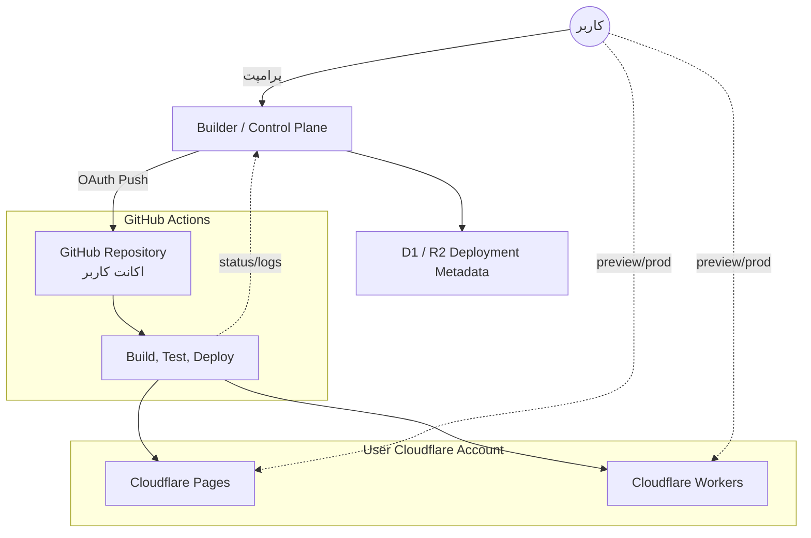

# GitHub-First Build and Deploy Workflow for Cloudflare Stack

این سند چرخه تولید، تست و استقرار برای استک جدید `Cloudflare-first` را توضیح می‌دهد.
در این مدل:

- سورس‌کد روی `GitHub` کاربر منبع حقیقت است
- build و deploy با `GitHub Actions` انجام می‌شود
- runtime نهایی روی `Cloudflare account` خود کاربر بالا می‌آید
- ما **سرور اجرایی جداگانه‌ای از خودمان** برای runtime اپ کاربر نداریم
- پلتفرم ما فقط نقش `control plane`, `orchestration`, و `metadata` را دارد

---

## استراتژی کلان دیپلوی

برای کاهش هزینه، حفظ مالکیت کاربر، و حذف نیاز به backend runtime اختصاصی، سیستم از این قواعد پیروی می‌کند:

### ۱. استراتژی فرانت‌اند
فرانت‌اند تولید شده، که معمولاً با `SvelteKit` ساخته می‌شود، از طریق `GitHub Actions` به یکی از targetهای زیر روی Cloudflare account کاربر deploy می‌شود:

- `Cloudflare Pages` برای پروژه‌های static یا adapter-based
- `Cloudflare Workers` برای پروژه‌های SSR یا full-stack edge

### ۲. استراتژی منطق و runtime

- `TypeScript` زبان اصلی platform و app templates است
- `Rust/Wasm` فقط برای ماژول‌های performance-sensitive یا تخصصی استفاده می‌شود
- build روی سرورهای ما انجام نمی‌شود؛ داخل `GitHub Actions` روی repository کاربر انجام می‌شود
- deploy نهایی با `wrangler deploy` یا `wrangler pages deploy` به account خود کاربر می‌رود
- runtime نهایی داخل `Cloudflare Workers` یا `Cloudflare Pages` اجرا می‌شود، نه داخل Super Node

---

## Flow: From Prompt to Production

### 1. Scaffolding and Generation
- **Actor:** User + Builder Agent
- **Action:** کاربر درخواست ساخت یا تغییر اپ را می‌دهد
- **Output:**
  - `Portal/App Code` بر پایه `SvelteKit`, `Workers`, یا templateهای آماده
  - فایل‌های config مربوط به `wrangler`
  - workflowهای `GitHub Actions` در `.github/workflows/`
  - metadata و snapshotهای لازم در control plane

### 2. Version Control on User GitHub
- **Action:** پلتفرم با اجازه کاربر به `GitHub` متصل می‌شود
- **Process:**
  1. یک repo جدید ساخته می‌شود یا repo موجود انتخاب می‌شود
  2. فایل‌های پروژه، workflowها و configها commit و push می‌شوند
  3. `GitHub` منبع حقیقت رسمی کد باقی می‌ماند

### 3. CI/CD Pipeline in GitHub Actions
به محض push شدن تغییرات، `GitHub Actions` در repository کاربر فعال می‌شود. این pipeline معمولاً این مراحل را دارد:

- `install dependencies`
- `typecheck`
- `lint`
- `test`
- `build`
- `deploy to Cloudflare`

#### Pipeline فرانت‌اند و اپ
- `Build`: پروژه `SvelteKit` یا app edge را build می‌کند
- `Deploy`:
  - برای `Pages`: با `wrangler pages deploy`
  - برای `Workers`: با `wrangler deploy`

#### Pipeline ماژول‌های تخصصی
- اگر ماژول `Rust/Wasm` یا artifact تخصصی وجود داشته باشد:
  - build داخل GitHub Actions انجام می‌شود
  - artifact در release یا storage مرتبط ثبت می‌شود
  - نسخه نهایی به target Cloudflare مناسب متصل می‌شود

### 4. Execution on User Cloudflare Account
پس از موفقیت pipeline:

- deployment نهایی روی `Cloudflare account` خود کاربر فعال می‌شود
- runtime روی `Workers` یا `Pages` اجرا می‌شود
- preview و production هر دو CI-backed هستند
- پلتفرم ما فقط status, metadata, deployment history و failure summary را نگه می‌دارد
- نیازی به fetch/run در runtime جداگانه از سمت ما وجود ندارد

---

## Workflow Architecture

نمای گرافیکی این جریان کاری:

---

## مزایای این رویکرد
1. **بدون runtime جداگانه از سمت ما:** execution plane روی زیرساخت خود Cloudflare و اکانت کاربر قرار می‌گیرد.
2. **هزینه کمتر:** build و deploy از مسیر `GitHub Actions` عبور می‌کند و نیاز به build farm داخلی را کم می‌کند.
3. **مالکیت و شفافیت:** repo، workflow، و deployment target برای کاربر قابل مشاهده و auditable است.
4. **production parity بهتر:** همان مسیری که deploy را انجام می‌دهد، مسیر رسمی CI/CD هم هست.
5. **سازگاری با استک جدید:** این مدل با `ARCHITECTURE_V5_GITHUB_ACTIONS_USER_CF.md` و `CLOUDFLARE_FIRST_ECOSYSTEM.md` هم‌راستا است.
