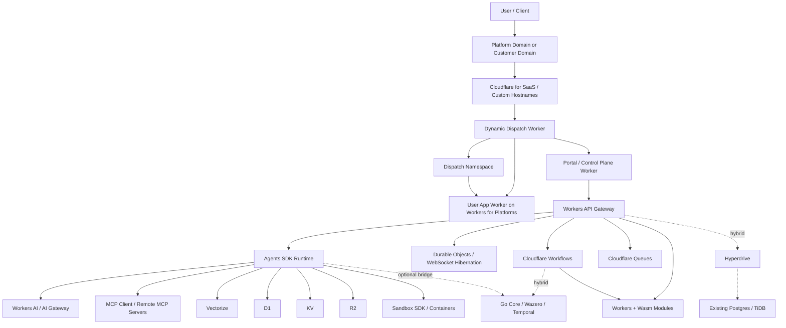
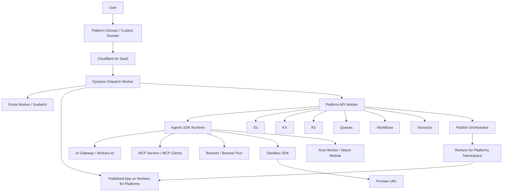

# معماری پیشنهادی Cloudflare-First برای کل اکوسیستم Nexus

**وضعیت:** Draft  
**هدف:** طراحی یک مسیر عملی برای انتقال اکوسیستم Nexus / Super Node به معماری `Cloudflare-first` با حفظ قابلیت اجرای Wasm، عامل‌های AI، ذخیره‌سازی، ورک‌فلو، و MCP

---

## Historical Context

بخش‌های بعدی تا قبل از `Target Architecture V2` باید به‌عنوان **context تاریخی migration** خوانده شوند، نه baseline اجرایی فعلی.

کارکرد این بخش‌ها:

- ثبت مسیر فکری مهاجرت از معماری قبلی
- نگه‌داشتن trade-offهای قدیمی برای ارجاع طراحی
- توضیح اینکه چرا بعضی گزینه‌های hybrid یا transitional بررسی شدند

قاعده خواندن این سند از این به بعد این است:

- baseline فعال پروژه از `## 5.1 Target Architecture V2` شروع می‌شود
- `## 5.2 Track C` addendum رسمی برای self-hosted execution plane است
- هر چیزی قبل از `5.1` اگر با baseline جدید تعارض داشت، **Historical Context** محسوب می‌شود

---

## 1. جمع‌بندی کوتاه

اگر بخواهیم کل اکوسیستم را روی Cloudflare جلو ببریم، بهترین تصمیم این نیست که همه چیز را یک‌باره بازنویسی کنیم. تصمیم درست این است که:

1. **لبه، API، Agent Session، Realtime و Storage را Cloudflare-native کنیم.**
2. **Wasm را به دو دسته تقسیم کنیم:**
   - **Edge Wasm** برای ماژول‌های سبک، pure compute و کم‌وابسته
   - **Core Wasm** برای ماژول‌هایی که هنوز به سازگاری بیشتر با `WASI`, `TinyGo`, یا میزبان Go نیاز دارند
3. **ارکستراسیون را از Temporal-heavy به Workflows/Agents-first نزدیک کنیم**، اما تا قبل از اثبات کامل، مسیر هیبریدی را نگه داریم.
4. **Go Gateway/BFF را کوچک کنیم یا حذف کنیم** و API اصلی را به `Workers + Durable Objects + D1/R2/Queues/Vectorize` منتقل کنیم.

نتیجه این رویکرد:

- latency کمتر برای کاربر نهایی
- حذف بخش بزرگی از infra management
- هم‌راستایی بیشتر با `AI-native` و `agent-native` platform
- امکان ساخت Marketplace و Remote MCP روی همان بستر

---

## 2. اصل تصمیم معماری

معماری نهایی باید بر این اصل بنا شود:

**Cloudflare لایه Control Plane و Edge Runtime باشد، نه صرفاً CDN.**

یعنی:

- `Portal` روی Cloudflare اجرا شود
- `API Gateway / BFF` روی Workers باشد
- `Agent session state` روی Durable Objects / Agents SDK باشد
- `Async orchestration` روی Workflows و Queues باشد
- `Relational metadata` روی D1 یا در فاز گذار روی Hyperdrive به DB فعلی باشد
- `Artifacts / logs / wasm binaries / outputs` روی R2 باشد
- `Semantic memory` روی Vectorize باشد
- `AI inference` روی Workers AI و `AI Gateway` باشد (با بهره‌گیری از **Function Calling** برای تعامل با ابزارها و **Batch API** برای پردازش‌های آفلاین)
- `MCP client/server` روی Agents platform سوار شود

---

## 3. واقعیت مهم درباره Wasm روی Cloudflare

Cloudflare Workers از `WebAssembly.instantiate()` پشتیبانی می‌کند و می‌تواند Wasm اجرا کند، اما برای معماری Nexus باید این محدودیت‌ها را از ابتدا در نظر بگیریم:

1. **Workers تک‌ترد است** و `threading` در Wasm پشتیبانی نمی‌شود.
2. **WASI روی Workers هنوز کامل و بالغ مثل runtimeهای اختصاصی نیست** و بخشی از syscallها ممکن است در دسترس نباشند.
3. **باینری Wasm هرچه بزرگ‌تر شود، startup cost بیشتر می‌شود**؛ بنابراین باید ماژول‌ها کوچک و هدفمند باشند.

نتیجه:

- اگر ماژول TinyGo/Wasm ما فقط محاسبه، rule evaluation، policy execution، transform، scoring، parsing یا inference orchestration سبک انجام می‌دهد، **Workers/Wasm انتخاب مناسبی است**.
- اگر ماژول به رفتارهای host-specific، وابستگی‌های سنگین، سازگاری عمیق با `WASI` یا embedding فعلی در `Go + Wazero` نیاز دارد، **فعلاً بهتر است داخل هسته Go بماند**.

پس پیشنهاد نهایی:

- **Edge Wasm on Workers** برای capabilityهای کوچک و sandboxed
- **Core Wasm on Go/Wazero** برای capabilityهای حساس‌تر تا زمان بلوغ بیشتر migration

---

## 4. نگاشت اجزای فعلی به سرویس‌های Cloudflare

| بخش فعلی | وضعیت فعلی | مقصد پیشنهادی روی Cloudflare | تصمیم |
| :--- | :--- | :--- | :--- |
| `Portal1 / SvelteKit` | فرانت‌اند وب | `Cloudflare Pages` یا `Workers` با SvelteKit adapter | مهاجرت مستقیم |
| `BFF` | Node/Bun bridge | `Cloudflare Workers` | حذف تدریجی |
| `Go Gateway` | API و orchestration | `Workers` برای edge APIs، نگه‌داشتن Go فقط برای core workloads | هیبریدی سپس کاهش |
| `WebSocket handler` | داخل backend | `Durable Objects` یا `Agents SDK sessions` | مهاجرت قوی |
| `Workflow / Temporal` | durable orchestration | `Cloudflare Workflows` + `Agents fibers/scheduling` | مهاجرت تدریجی |
| `Wazero runtime` | اجرای Wasm در Go | `Workers Wasm` برای edge modules، نگه‌داشتن `Wazero` برای core modules | دو-مسیره |
| `Redis` | state/cache | `KV` برای read-heavy config، `Durable Objects` برای stateful coordination | جایگزینی بخشی |
| `Postgres/TiDB` | relational + analytics + logs | `D1` برای metadata، `R2` برای logs/artifacts، `Hyperdrive` برای DBهای موجود در گذار | تفکیک مسئولیت |
| `Redpanda` | event bus | `Cloudflare Queues` | مهاجرت برای async/event workload |
| `Vector memory` | TiDB Vector یا مشابه | `Vectorize` | مهاجرت مستقیم |
| `Model access` | provider-specific | `Workers AI` + `AI Gateway` | مهاجرت مستقیم (استفاده از Function Calling و Batch API) |
| `Preview / code execution` | اجرای کد تولیدشده یا untrusted | `Sandbox SDK` / `Containers` / `Dynamic Workers` | بر اساس workload |
| `Published user apps` | میزبانی اپ‌های خروجی کاربران | `Workers for Platforms` | ستون محصولی |
| `Custom domains / white-label` | دامنه اختصاصی مشتری | `Cloudflare for SaaS` | ستون تجاری |
| `MCP marketplace` | design phase | `Agents SDK` + Remote MCP server/client | هم‌راستای native |
| `Agent builder` | draft/runtime UX | `VibeSDK` به عنوان reference architecture | الگوی پیاده‌سازی |

---

## 5. معماری هدف



## Active Baseline

از این نقطه به بعد، متن زیر baseline اجرایی فعال پروژه است و باید نسبت به بخش `Historical Context` اولویت تفسیر داشته باشد.

### یادداشت راهبردی

دیاگرام بالا هنوز یک مدل **سازگار با migration هیبریدی** را نشان می‌دهد.  
اگر تصمیم اجرایی پروژه این باشد که **فعلاً هیچ سرور جداگانه‌ای بالا نیاید** و تمام محصول روی Cloudflare بسته شود، باید `Target Architecture V2` زیر را مبنای implementation بدانیم.

## 5.1 Target Architecture V2: Cloudflare-First / TS+Rust / VibeSDK-First

این نسخه، معماری عملیاتی پیشنهادی برای شروع ساخت واقعی است؛ با این فرض که:

- `Go Gateway`, `Temporal`, `Postgres/TiDB`, و هر backend جداگانه فعلاً حذف می‌شوند
- platform logic با `TypeScript` پیاده می‌شود
- `Rust` فقط برای Workerهای تخصصی یا ماژول‌های Wasm انتخاب می‌شود
- builder experience با الهام مستقیم از `VibeSDK` طراحی می‌شود
- `Cloudflare` target پیش‌فرض control plane و runtime است، اما برای executionهای پیشرفته می‌توان target اختیاری self-hosted هم داشت

### اصول این نسخه

1. **TypeScript زبان اصلی platform است**
2. **Rust زبان تخصصی برای performance modules است**
3. **هر چیز user-facing به‌صورت پیش‌فرض روی Workers/Agents اجرا می‌شود**
4. **هر چیز publishable به‌صورت پیش‌فرض روی Workers for Platforms می‌نشیند**
5. **هر چیز white-label به‌صورت پیش‌فرض با Cloudflare for SaaS تحویل می‌شود**
6. **self-hosted execution plane برای customer-owned infra یک target اختیاری و advanced است**
7. **state حیاتی control plane باید در Cloudflare باقی بماند، حتی اگر بخشی از execution خارج از Cloudflare انجام شود**

### توزیع مسئولیت زبان‌ها

- `TypeScript`
  - Portal
  - API / dispatch / routing
  - Agents SDK logic
  - Builder orchestration
  - publish pipeline
  - marketplace / registry / auth / billing hooks
- `Rust`
  - compute-heavy Workers
  - deterministic policy engines
  - parser/transformation modules
  - reusable Wasm packages for hot paths

### دیاگرام Target V2



### ماژول‌های اصلی در V2

| ماژول | تکنولوژی اصلی | نقش |
| :--- | :--- | :--- |
| `Portal` | `SvelteKit + Workers` | UI اصلی پلتفرم |
| `Platform API` | `TypeScript Workers` | auth, tenant resolution, orchestration, publish control |
| `Agent Runtime` | `Agents SDK` | chat, builder, support, MCP-aware agents |
| `Builder Execution` | `Sandbox SDK` | اجرای workspace, build, test, preview |
| `Fast Code Mode` | `Dynamic Workers` | اجرای سریع و سبک برای کدهای کوچک |
| `Published Apps` | `Workers for Platforms` | میزبانی خروجی appهای کاربر |
| `Custom Domains` | `Cloudflare for SaaS` | اتصال دامنه مشتری و SSL |
| `Metadata DB` | `D1` | users, tenants, apps, deployments |
| `Artifacts` | `R2` | فایل‌ها، خروجی‌ها، bundleها، logها |
| `Realtime State` | `Agents SDK / Durable Objects` | session, state sync, coordination |
| `Async Jobs` | `Queues + Workflows` | publish jobs, approval flows, retries |
| `Semantic Memory` | `Vectorize` | docs, memory, search, discovery |

---

## 5.2 Architecture Addendum: Track C - wasmCloud Self-Hosted Runtime

این بخش یک addendum رسمی به `Target Architecture V2` است.  
هدف آن این نیست که baseline را از Cloudflare جدا کند؛ هدف آن این است که baseline را از `Cloudflare-only` به این مدل ارتقا دهد:

- `Cloudflare-first control plane`
- `Cloudflare-native default runtime`
- `Optional self-hosted execution plane`

### چرا این addendum لازم است؟

چون بعضی workloadها و customer profileها با target کاملاً Cloudflare-native بهترین جواب را نمی‌گیرند، مخصوصاً وقتی:

- execution باید داخل شبکه خصوصی مشتری بماند
- workload به host access یا hardware access نیاز دارد
- edge gateway یا nodeهای customer-owned وجود دارند
- policy یا governance اجازه خروج compute از محیط مشتری را نمی‌دهد
- بعضی agent/moduleها باید نزدیک data source اجرا شوند

### نقش `wasmCloud`

`wasmCloud` در این معماری جایگزین کامل Cloudflare نیست.  
نقش آن این است که execution plane اختیاری برای Wasm workloads روی این targetها فراهم کند:

- سرور شخصی مشتری
- bare metal
- VM
- Kubernetes cluster
- edge node
- on-prem environment

### اصل تفکیک مسئولیت

در مدل addendum:

- `Cloudflare` مسئول `Portal`, `Platform API`, `Auth`, `Metadata`, `Registry`, `Orchestration`, `Observability entry`, و `Default Publish Path` است
- `wasmCloud` مسئول `customer-owned Wasm execution` برای workloadهای اختیاری self-hosted است
- `Workers for Platforms` همچنان target پیش‌فرض برای appها و capabilityهای استاندارد cloud-native باقی می‌ماند
- `wasmCloud` target دوم و optional برای executionهای advanced است، نه baseline پیش‌فرض

### نقش `Durable Objects` در Track C

ورود `wasmCloud` به معنی حذف `Durable Objects` از معماری نیست.  
ما همچنان به `Durable Objects` برای مدیریت `Control Plane` نیاز داریم؛ اما نوع state که در Cloudflare نگه می‌داریم تغییر می‌کند.

#### قبل از Track C

- state می‌توانست در سطح `agent/session/run` نگه‌داری شود
- یعنی Cloudflare ممکن بود وضعیت تعداد زیادی agent فعال را مستقیم ببیند و مدیریت کند

#### بعد از Track C

- state در Cloudflare باید بیشتر در سطح `cluster`, `deployment target`, `runtime connectivity`, و `desired state` نگه‌داری شود
- به‌جای نگه‌داری وضعیت تک‌تک agentهای self-hosted، فقط وضعیت کلی clusterهای مشتری و اتصال execution plane آن‌ها مدیریت می‌شود
- `Durable Objects` بهترین primitive برای نگه‌داری همین state کنترل‌پلین خوشه‌ای هستند: cluster presence, heartbeat summary, routing coordination, runtime session ownership, reconcile status

#### نتیجه عملی

- حجم state در Cloudflare به‌شدت کاهش می‌یابد
- به‌جای ذخیره وضعیت ۱۰۰۰ agent فعال، می‌توان فقط وضعیت ۱۰ cluster یا ۱۰ execution target را نگه داشت
- Cloudflare از `agent-state manager` به `cluster-control-plane coordinator` نزدیک می‌شود

### Track C چه چیزهایی را پوشش می‌دهد؟

- private integrations
- on-prem agents
- edge execution nodes
- deterministic or host-bound Wasm modules
- customer-owned runtime برای capabilityهای امنیتی یا نزدیک به داده

### Track C چه چیزهایی را پوشش نمی‌دهد؟

- portal hosting
- browser UX
- default tenant routing
- public SaaS delivery
- white-label domain delivery
- control-plane metadata ownership

### deployment targets بعد از این addendum

هر artifact یا capability باید یکی از این targetها را داشته باشد:

1. `cloudflare-default`
   - target پیش‌فرض
   - مناسب برای portal features, standard apps, lightweight modules, default publish path
2. `self-hosted-wasmcloud`
   - target اختیاری
   - مناسب برای private, on-prem, edge-owned یا host-aware execution

### قاعده تصمیم runtime

اگر workload:

- user-facing است
- realtime/session-centric است
- با chat, approval, browser tooling یا publish UX یکپارچه است

آنگاه target پیش‌فرض آن **Cloudflare runtime** است.

اگر workload:

- pure compute یا policy-heavy است
- نیاز به private network یا host access دارد
- باید روی infra خود مشتری اجرا شود
- به portability بین cloud / datacenter / edge نیاز دارد

آنگاه target آن می‌تواند **`wasmCloud` self-hosted runtime** باشد.

### مرز state

حتی در مدل self-hosted:

- desired state
- deployment registry
- tenant metadata
- app metadata
- artifact index
- integration configuration metadata

باید در control plane باقی بماند و baseline آن Cloudflare باشد.

و در Track C علاوه بر این‌ها:

- cluster status summary
- lattice connectivity summary
- deployment target health summary
- last-seen heartbeat برای runtimeهای self-hosted

هم در Cloudflare نگه‌داری می‌شوند، اما نه به‌صورت per-agent state بلکه به‌صورت cluster-level state.

### انعطاف‌پذیری backend در Track C

معماری self-hosted باید backend-agnostic بماند.

- Wasm component یا agent نباید بداند backend زیرین `TiDB`, `Redis`, `Postgres`, یا هر datastore دیگری است
- component فقط با capability contract یا service interface کار می‌کند
- انتخاب datastore باید در سطح provider / host plugin / service binding انجام شود

این رویکرد دو مزیت کلیدی دارد:

1. جابه‌جایی بین محیط تست و production بسیار ساده‌تر می‌شود
2. backend stack می‌تواند بر اساس نیاز customer تغییر کند، بدون اینکه component logic بازنویسی شود

برای همین در Track C:

- query-heavy یا SQL-heavy workloadها می‌توانند پشت `TiDB` یا datastoreهای توزیع‌شده قرار بگیرند
- state/cache workloadها می‌توانند پشت `Redis` یا provider مشابه قرار بگیرند
- Wasm workload فقط contract را می‌بیند، نه vendor implementation را

### معماری نامتقارن Track C

Track C لزوماً به معنی اجرای یکسان همه nodeها نیست.  
معماری درست می‌تواند **نامتقارن** باشد:

- `Super Nodes`
  - در دیتاسنتر یا محیط قدرتمندتر
  - مسئول workloadهای سنگین، queryهای پیچیده، orchestration داخلی، datastore access و پردازش‌های پرهزینه
- `Edge Agents`
  - روی سخت‌افزار سبک‌تر کاربر نهایی یا edge gateway
  - مسئول capabilityهای نزدیک به دستگاه، private network access، local tool execution، و lightweight inference/automation

این nodeها می‌توانند از طریق `lattice` یک fabric یکپارچه بسازند، در حالی که control plane هنوز در Cloudflare باقی می‌ماند.

### قاعده topology

در Track C لازم نیست همه customer runtimeها هم‌سطح باشند:

- بعضی customerها فقط یک node self-hosted دارند
- بعضی customerها یک cluster کامل `wasmCloud` دارند
- بعضی customerها ترکیبی از `Super Node + Edge Agent` دارند

control plane باید هر سه topology را با یک abstraction واحد ببیند:

- `execution target`
- `cluster`
- `node class`
- `runtime health`

### تغییر در publish model

publish از این به بعد یک‌مسیره نیست.  
دو نوع publish داریم:

1. `Publish to Workers for Platforms`
2. `Publish to Self-Hosted wasmCloud`

در حالت دوم:

- platform manifest یا deployment spec تولید می‌کند
- artifact/component در registry مناسب publish می‌شود
- customer runtime آن را pull و اجرا می‌کند
- platform فقط desired state, status, run metadata و health summary را مدیریت می‌کند

### GitHub Actions dual-route deployment

مدل deploy در Track C باید از همان ابتدا دو مسیر رسمی را پشتیبانی کند:

```mermaid
graph TD
    UserCode[User GitHub Repository] --> GHA[GitHub Actions Pipeline]

    subgraph Route A: Cloudflare Deployment (Default / Free Tier)
        GHA --> Wrangler[Wrangler Deploy]
        Wrangler --> CFWorkers[Cloudflare Workers / Pages]
    end

    subgraph Route B: wasmCloud Deployment (Advanced / Private Edge)
        GHA --> BuildWasm[Compile to WebAssembly Component]
        BuildWasm --> PushOCI[Push to OCI Registry]
        PushOCI --> WCL[wasmCloud Lattice / NATS]
    end
```

#### تفسیر deploy routes

- Route A مسیر پیش‌فرض برای free-tier, standard SaaS delivery و publish ساده است
- Route B مسیر advanced برای customer-owned runtime, private edge و on-prem execution است
- انتخاب route باید بخشی از deployment metadata باشد، نه تصمیم ad-hoc داخل pipeline
- builder و publish orchestrator باید از ابتدا `runtime target aware` باشند

### نسبت `wasmCloud` با `Go/Wazero`

`wasmCloud` الزاماً جایگزین فوری `Go + Wazero` نیست.

- `Go + Wazero`
  - برای embedded execution ساده‌تر
  - برای subsetهای core و deterministic
  - برای migration سبک‌تر
- `wasmCloud`
  - برای distributed self-hosted execution
  - برای customer-owned runtime fabric
  - برای multi-host / edge / on-prem topology

### تعریف رسمی baseline جدید

از این addendum به بعد، baseline این پروژه چنین تفسیر می‌شود:

- `Cloudflare` لایه پیش‌فرض و رسمی control plane است
- `Cloudflare` target پیش‌فرض برای runtime و publish است
- `self-hosted execution plane` مجاز است، اما optional و advanced است
- `wasmCloud` candidate اصلی برای پیاده‌سازی این execution plane اختیاری است

### پیام اجرایی برای فازهای بعدی

- فاز 1 و baseline محصول همچنان باید روی Cloudflare بسته شود
- Track C نباید delivery فاز اول را متوقف کند
- contractها از همین حالا باید multi-target طراحی شوند
- naming و deployment metadata باید از حالا `runtime target aware` باشند

---

## 6. نقش هر سرویس Cloudflare در Nexus

### 6.1 Workers

`Workers` باید جای `BFF` و بخشی از `Go Gateway` را بگیرد:

- API gateway
- auth/session entrypoint
- request shaping
- model routing
- edge-side validation
- lightweight orchestration
- dispatch به Queue / Workflow / Agent / Durable Object

این لایه باید thin باشد و منطق domain-heavy فقط در جاهایی بماند که واقعاً به runtime اختصاصی نیاز داریم.

### 6.2 Agents SDK

برای بخش agentic، این احتمالاً مهم‌ترین سرویس جدید است. هر Agent روی Durable Object-backed runtime می‌نشیند و این قابلیت‌ها را بومی می‌دهد:

- durable identity
- local state
- local SQL storage
- scheduling
- recoverable execution
- realtime connections
- tool calling
- MCP integration

در معماری Nexus، این یعنی:

- هر `user agent`, `workspace agent`, `market watcher agent`, `builder agent`, `support agent` می‌تواند یک Agent instance پایدار داشته باشد.
- به‌جای بازسازی session در BFF، state نزدیک خود Agent نگه داشته می‌شود.
- approval flow, HITL, long-turn chat, background work و browser/tool execution طبیعی‌تر می‌شوند.

### 6.3 Durable Objects

اگر Agents SDK را هم استفاده کنیم، باز هم Durable Objects در لایه coordination ارزش کلیدی دارد:

- room/session coordination
- websocket fanout
- distributed locks
- presence
- ephemeral workflow checkpoints
- per-tenant coordinator

برای Nexus این بهترین جایگزین برای بخشی از WebSocket handler و state synchronization فعلی است.

### 6.4 D1

`D1` برای این موارد مناسب است:

- tenant metadata
- agent registry
- capability registry
- app config
- user preferences
- deployment metadata
- MCP installation metadata
- workflow execution index

اما برای این موارد **فعلاً انتخاب اول نیست**:

- HTAP سنگین
- analytics حجیم
- event lake
- log storage انبوه
- relational joins خیلی سنگین در مقیاس بزرگ

پس D1 را باید **Control Plane DB** ببینیم، نه جایگزین همه‌چیز.

### 6.5 R2

`R2` باید object plane اصلی ما شود:

- Wasm binaries
- build artifacts
- agent outputs
- prompt snapshots
- large logs
- dataset files
- exported reports
- user-uploaded files

برای اکوسیستم شما، `R2` از `TiDB for logs` یا object blobs بهتر و ساده‌تر است.

### 6.6 KV

`KV` برای داده‌هایی خوب است که read-heavy هستند و consistency لحظه‌ای نمی‌خواهند:

- feature flags
- cached summaries
- routing maps
- public capability manifests
- edge config

KV را نباید جای state هماهنگ‌شده یا transaction گذاشت.

### 6.7 Queues

`Queues` معادل مستقیم‌تر لایه eventing سبک در Cloudflare است:

- webhook buffering
- async tool execution
- retryable ingestion
- fan-out task dispatch
- dead-letter flow

برای بخش زیادی از workloadهایی که امروز با `Redpanda` یا job queue انجام می‌شوند، در فاز Cloudflare-first کافی است.

### 6.8 Workflows

`Workflows` نزدیک‌ترین گزینه Cloudflare برای جایگزینی بخشی از Temporal است:

- multi-step durable execution
- automatic retry
- pause/wait for external events
- human-in-the-loop
- scheduled continuation

برای این use caseها خیلی مناسب است:

- draft -> approval -> execute
- AI generation -> validation -> publish
- artifact build -> test -> release
- agent task with approval gates

اما اگر workflowها بسیار پیچیده، high-volume و deeply integrated با runtime فعلی Go باشند، بهتر است ابتدا hybrid بمانیم.

### 6.9 Workers AI + AI Gateway

لایه AI روی Cloudflare باید این‌گونه چیده شود:

- `AI Gateway` برای routing, logging, caching, fallback, cost visibility
- `Workers AI` برای مدل‌های بومی Cloudflare
- provider fallback برای OpenAI/Anthropic/Gemini وقتی لازم باشد

این رویکرد به‌خصوص برای builder, assistant, workflow summary, extraction, RAG و moderation مناسب است.

### 6.10 Vectorize

`Vectorize` بهترین جایگزین native برای semantic memory است:

- long-term semantic memory
- artifact/document search
- RAG index for docs, workflows, templates
- capability search
- marketplace discovery

الگوی پیشنهادی:

- metadata در `D1`
- blob در `R2`
- embedding/index در `Vectorize`

### 6.11 Hyperdrive

اگر بخواهیم سریع مهاجرت کنیم ولی فعلاً دیتابیس اصلی را نگه داریم، `Hyperdrive` بسیار مهم است:

- `Workers` می‌توانند به `Postgres/MySQL` فعلی وصل شوند
- latency برای queryهای edge بهتر می‌شود
- migration بزرگ دیتابیس را عقب می‌اندازیم

در عمل:

- اول API را به Workers می‌بریم
- بعد storage را تدریجی از DB اصلی به `D1/R2/Vectorize` می‌بریم

این امن‌ترین مسیر برای MVP و production migration است.

### 6.12 Workers for Platforms

`Workers for Platforms` بخش کلیدی‌ای است که سند قبلی هنوز به‌صورت کامل باز نکرده بود. این سرویس برای شما فقط یک گزینه deployment نیست، بلکه **هسته مدل پلتفرمی Nexus** است.

اجزای اصلی آن:

- `dispatch namespace` برای نگه‌داری مجموعه Workerهای کاربر/tenant
- `dynamic dispatch Worker` برای routing برنامه‌پذیر
- `user Workers` برای اجرای اپ‌های منتشرشده
- `outbound Worker` برای کنترل egress, policy و abuse protection

در معماری Nexus این یعنی:

- هر app یا capability منتشرشده توسط کاربر می‌تواند به‌عنوان یک `user Worker` مستقل deploy شود.
- لایه platform می‌تواند از طریق `dispatch Worker` تصمیم بگیرد کدام hostname, tenant, path یا metadata به کدام Worker برود.
- به‌جای host کردن همه خروجی‌ها داخل یک monolith، هر خروجی در isolate خودش اجرا می‌شود.

کاربرد مستقیم برای بیزنس مدل شما:

- `tenant app hosting`
- `app builder publish`
- `multi-tenant isolation`
- `per-app resource binding`
- `per-deployment tagging, limits, observability`

### 6.13 Cloudflare for SaaS

`Cloudflare for SaaS` مکمل مستقیم `Workers for Platforms` است.

اگر `Workers for Platforms` می‌گوید اپ‌های کاربران را چگونه deploy و route کنیم، `Cloudflare for SaaS` می‌گوید **چطور همین اپ‌ها را روی دامنه اختصاصی مشتری با SSL و مدیریت hostname ارائه کنیم**.

کاربردهای اصلی:

- vanity domains
- white-label portals
- branded app delivery
- enterprise tenant domains
- customer-managed hostnames with managed SSL

در Nexus این بخش برای این سناریوها حیاتی است:

- کاربر عادی روی `tenant.nexus.yourdomain.com`
- مشتری حرفه‌ای روی `app.customer.com`
- سازمان بزرگ روی دامنه اختصاصی workspace خودش

الگوی پیشنهادی:

- `Workers for Platforms` برای compute/app isolation
- `Cloudflare for SaaS` برای custom hostname + TLS + routing entrypoint
- `dispatch Worker` برای تصمیم routing

### 6.14 Sandbox SDK, Containers و Dynamic Workers

سه primitive متفاوت برای اجرای کد تولیدشده یا untrusted وجود دارد و نباید با هم قاطی شوند:

- `Dynamic Workers`
  - سبک‌ترین گزینه برای اجرای سریع کد sandboxed
  - مناسب برای previewهای سبک، automationهای کوچک، و code-mode سریع
- `Sandbox SDK`
  - مناسب وقتی agent یا builder به filesystem, shell, package manager, test runner و preview URL نیاز دارد
  - بهترین گزینه برای تجربه شبیه VibeSDK
- `Containers`
  - وقتی runtime سفارشی، image اختصاصی، یا workload سنگین‌تر لازم است

قاعده استفاده:

- اگر فقط execution سریع و سبک می‌خواهیم: `Dynamic Workers`
- اگر workspace واقعی، فایل، build و debug می‌خواهیم: `Sandbox SDK`
- اگر image/runtime سفارشی یا مصرف بالاتر لازم است: `Containers`

---

## 7. تکلیف Go, Wazero و TinyGo در این معماری

### پیشنهاد نهایی

ما نباید فوراً `Go + Wazero + TinyGo` را حذف کنیم. باید آن را به دو لایه تبدیل کنیم:

### Track A: Cloudflare-native Agent Runtime

برای این‌ها:

- chat agents
- builder agents
- support agents
- MCP-enabled assistants
- approval-driven workflows
- realtime user-facing automation

پیشنهاد: `Agents SDK + Durable Objects + Workflows`

### Track B: Core Compute Runtime

برای این‌ها:

- TinyGo/Wasm policy engines
- deterministic execution modules
- scoring engines
- market transforms
- modules requiring current Go host contracts

پیشنهاد:

- در کوتاه‌مدت: `Go + Wazero`
- در میان‌مدت: subset منتخب را به `Workers Wasm` ببریم

### قاعده تصمیم

اگر capability:

- user-facing است
- نیاز به realtime/session/tool use دارد
- با AI loop یکپارچه است

آنگاه بهتر است **Agent-native روی Cloudflare** باشد.

اگر capability:

- pure compute است
- deterministic است
- host contract محدودی دارد

آنگاه بهتر است **Wasm روی Workers** یا **Wazero** باشد.

---

## 8. MCP و Marketplace روی Cloudflare

Cloudflare Agents به‌صورت طبیعی برای `Remote MCP Server` و `MCP Client` مناسب است. برای پروژه Nexus این یعنی:

- marketplace می‌تواند registry خود را در `D1` نگه دارد
- manifestها و static assets در `R2/KV` باشند
- اجرای MCP tools از طریق Agent runtime انجام شود
- ابزارهای third-party به‌صورت remote و امن expose شوند

پیشنهاد ساختار:

1. **MCP Registry**
   - `D1` برای metadata
   - `R2` برای manifests/assets
2. **MCP Runtime**
   - `Workers/Agents` برای اتصال و auth
3. **MCP Security**
   - scoped tokens
   - per-tenant bindings
   - audit trail در `R2/D1`

این بخش از همه قسمت‌ها بیشترین هم‌راستایی را با Cloudflare دارد.

---

## 9. VibeSDK، Workers for Platforms و مدل پلتفرم

سه لینک جدید Cloudflare یک پیام واضح دارند: استک جدید فقط برای migrate کردن backend نیست؛ بلکه برای **ساخت یک platform business** طراحی شده است.

ترجمه این سه لایه به زبان Nexus:

- `AI Vibe Coding Platform`:
  - الگوی مرجع برای builder product
  - نشان می‌دهد AI generation, sandboxed execution, preview, observability و deployment باید یک flow یکپارچه باشند
- `Workers for Platforms`:
  - deployment plane برای اپ‌ها، عامل‌ها و خروجی‌های user-generated
  - مناسب برای host کردن هزاران یا میلیون‌ها app/agent مجزا
- `Cloudflare for SaaS`:
  - delivery plane برای دامنه اختصاصی و white-label
  - مناسب برای commercial packaging روی دامنه مشتری

### 9.1 تطبیق با بیزنس مدل Nexus

اگر Nexus فقط یک Super Node نباشد و به یک platform تبدیل شود، این سه مدل درآمدی/محصولی مستقیماً پشتیبانی می‌شوند:

1. **Managed Nexus Cloud**
   - هر tenant یک workspace و app روی زیر دامنه شما می‌گیرد
   - مثال: `tenant-a.nexus.app`

2. **White-label / Enterprise**
   - هر مشتری دامنه خودش را به platform وصل می‌کند
   - مثال: `app.customer.com`
   - اینجا `Cloudflare for SaaS` وارد می‌شود

3. **Builder / Marketplace Economy**
   - کاربر agent/app/workflow می‌سازد
   - خروجی به‌عنوان `user Worker` deploy می‌شود
   - marketplace فقط registry نیست؛ یک deployment fabric هم هست

4. **Platform-as-a-Service for Agents**
   - Nexus می‌تواند نه فقط agent اجرا کند، بلکه runtime, hosting, custom domain, observability و distribution هم بفروشد

### 9.2 الگوی target برای builder

الگوی درست برای builder در Nexus باید این باشد:

1. کاربر prompt می‌دهد
2. `Agents SDK + AI Gateway` طرح و کد اولیه را تولید می‌کند
3. کد در `Sandbox SDK` یا `Dynamic Workers` اجرا و preview می‌شود
4. artifact یا app نهایی در `Workers for Platforms` منتشر می‌شود
5. در صورت نیاز، دامنه اختصاصی با `Cloudflare for SaaS` به آن attach می‌شود

این flow از نظر محصولی بسیار مهم است، چون builder را از یک "چت‌بات مولد کد" به یک "platform تولید، تست، انتشار و میزبانی" تبدیل می‌کند.

### 9.3 نقش VibeSDK

`VibeSDK` را نباید الزاماً به‌عنوان محصول نهایی کپی کنیم، اما باید آن را **reference architecture** برای این بخش‌ها ببینیم:

- AI app builder UX
- sandboxed code execution
- project templates
- AI-guided generation loop
- deploy-to-Workers-for-Platforms flow

در Nexus، VibeSDK می‌تواند الگوی خوبی برای این ماژول‌ها باشد:

- `Agent Builder`
- `App Builder`
- `MCP-enabled no-code / vibe workflow builder`
- `preview + publish + export pipeline`

اگر بخواهیم builder experience را سریع‌تر راه بیندازیم، استفاده از ایده‌های VibeSDK از ساخت صفر بسیار بهتر است؛ مخصوصاً در این سه بخش:

- preview loop
- sandbox lifecycle
- publish pipeline به `Workers for Platforms`

---

## 10. معماری پیشنهادی داده

### Control Plane

- `D1`
  - users
  - tenants
  - agent metadata
  - capability definitions
  - workflow registry
  - deployment records

### Coordination / Session Plane

- `Durable Objects`
  - user sessions
  - chat sessions
  - agent instances
  - room coordination
  - realtime state

### Cache / Distribution Plane

- `KV`
  - feature flags
  - config snapshots
  - public manifests
  - edge cached summaries

### Artifact Plane

- `R2`
  - wasm files
  - logs
  - generated assets
  - reports
  - uploads
  - archived workflow results

### Tenant Compute / Hosting Plane

- `Workers for Platforms`
  - user Workers
  - app deployments
  - per-tenant isolated runtimes
  - publish targets
  - tagged releases

### Delivery / Domain Plane

- `Cloudflare for SaaS`
  - custom hostnames
  - managed SSL
  - vanity domains
  - enterprise white-label domains

### Semantic Plane

- `Vectorize`
  - embeddings
  - RAG memory
  - doc search
  - marketplace discovery

### Legacy / Migration Plane

- `Hyperdrive -> Postgres/TiDB`
  - داده‌هایی که هنوز مهاجرت نکرده‌اند

---

## 11. مسیر مهاجرت پیشنهادی

## Phase 0: Hybrid Foundation

- `Portal` را روی Cloudflare مستقر کن
- `BFF` را به `Workers API` تبدیل کن
- `Hyperdrive` را جلوی DB فعلی بگذار
- `R2` را برای artifacts/logs فعال کن
- `AI Gateway` را جلو همه providerها بگذار
- `dispatch Worker` و `dispatch namespace` را برای publish plane آماده کن

**خروجی:** کاربر از Cloudflare Edge سرویس می‌گیرد بدون اینکه هنوز هسته Go حذف شده باشد.

## Phase 1: Agent-Native Edge

- Agent sessionها را روی `Agents SDK` منتقل کن
- realtime را به `Durable Objects` ببر
- workflowهای ساده را به `Workflows` منتقل کن
- `KV`, `D1`, `Queues` را برای control plane و async flows وارد کن
- preview/build execution را روی `Sandbox SDK` یا `Dynamic Workers` فعال کن

**خروجی:** بخش user-facing agent loop دیگر وابسته به BFF/Go نیست.

## Phase 2: Wasm Segmentation

- capabilityهای سبک را به `Workers + Wasm` منتقل کن
- capabilityهای سنگین را در `Go + Wazero` نگه دار
- قرارداد مشترک capability تعریف کن تا runtime شفاف شود

**خروجی:** runtime چندلایه اما استاندارد می‌شود.

## Phase 3: Marketplace + Builder

- MCP marketplace را روی Agents + D1 + R2 پیاده کن
- builder flow را با الهام از `VibeSDK` بساز
- preview, publish, deploy pipeline را Cloudflare-native کن
- app publish را روی `Workers for Platforms` ببند
- custom domains را با `Cloudflare for SaaS` اضافه کن

**خروجی:** Nexus از یک backend-heavy stack به یک Cloudflare-native agent platform تبدیل می‌شود.

---

## 11.1 Phase 1 Implementation Plan برای ساخت واقعی

این فاز بر مبنای `Target Architecture V2` تعریف می‌شود، نه مدل hybrid.  
هدف Phase 1 این نیست که همه featureها کامل شوند؛ هدف این است که **اسکلت production-grade پلتفرم Cloudflare-first با runtime پیش‌فرض Cloudflare** ساخته شود.

### هدف Phase 1

تا پایان این فاز باید این مسیر end-to-end کار کند:

1. کاربر وارد Portal می‌شود
2. با Builder Agent صحبت می‌کند
3. کد اولیه تولید می‌شود
4. داخل Sandbox اجرا و preview می‌شود
5. کاربر publish می‌کند
6. خروجی روی `Workers for Platforms` deploy می‌شود
7. metadata در `D1` ثبت می‌شود
8. artifactها در `R2` ذخیره می‌شوند

### خروجی‌های الزامی Phase 1

- یک `Portal` عملیاتی روی Workers
- یک `Platform API Worker`
- یک `Builder Agent`
- یک `Sandbox-backed preview flow`
- یک `Publish Orchestrator`
- یک `Workers for Platforms namespace`
- schema اولیه `D1`
- bucketهای اولیه `R2`
- ساختار tenant/app/deployment در `D1`

### محدوده Phase 1

#### داخل Scope

- login/session پایه
- tenant model پایه
- app draft model
- prompt -> generate -> preview -> publish
- deployment registry
- preview links
- basic logs and execution history
- یک template اولیه app

#### خارج از Scope

- billing کامل
- marketplace عمومی کامل
- multi-model policy پیچیده
- advanced collaboration
- full white-label automation
- enterprise governance کامل

### streamهای اجرایی

#### Stream A: Foundation

- ایجاد monorepo یا workspace با این لایه‌ها:
  - `apps/portal`
  - `apps/platform-api`
  - `apps/agents`
  - `apps/dispatch`
  - `packages/shared`
  - `packages/templates`
- تعریف `wrangler` config برای envهای `dev/staging/prod`
- اتصال `D1`, `R2`, `KV`, `Queues`, `Vectorize`

#### Stream B: Identity & Tenant Core

- تعریف مدل‌های `User`, `Tenant`, `Membership`, `App`, `Deployment`
- پیاده‌سازی auth/session اولیه
- ساخت tenant resolver بر اساس subdomain یا tenant id

#### Stream C: Builder Agent

- ساخت `BuilderAgent` روی `Agents SDK`
- اتصال به `AI Gateway`
- تعریف toolهای اولیه:
  - `generate_app_spec`
  - `generate_files`
  - `update_files`
  - `run_preview`
  - `publish_app`

#### Stream D: Sandbox Preview Runtime

- ایجاد sandbox image پایه برای app template
- نوشتن pipeline:
  - scaffold files
  - install deps
  - run dev/build
  - expose preview
- ثبت execution logs در `R2`

#### Stream E: Publish Plane

- راه‌اندازی `Workers for Platforms`
- ساخت `dispatch namespace`
- پیاده‌سازی `Publish Orchestrator`
- ثبت deployment metadata در `D1`
- tag کردن releaseها برای rollback بعدی

#### Stream F: Portal UX

- صفحه chat/builder
- صفحه preview
- صفحه deployments
- صفحه app settings

### schema اولیه پیشنهادی D1

- `users`
- `tenants`
- `memberships`
- `apps`
- `app_drafts`
- `deployments`
- `preview_sessions`
- `agent_runs`
- `artifacts`

### ساختار artifact در R2

- `tenants/{tenantId}/apps/{appId}/drafts/{draftId}/...`
- `tenants/{tenantId}/apps/{appId}/previews/{previewId}/...`
- `tenants/{tenantId}/apps/{appId}/deployments/{deploymentId}/bundle`
- `tenants/{tenantId}/apps/{appId}/logs/{runId}.log`

### تعریف دقیق مسئولیت Workerها

#### `dispatch Worker`

- route بر اساس hostname/path
- تشخیص platform routes در برابر published app routes
- اعمال metadata routing

#### `platform-api Worker`

- auth/session
- tenant context
- app CRUD
- publish orchestration
- preview session management

#### `agents Worker`

- builder agent
- support agent
- template assistant
- MCP-aware runtime

#### `published app Workers`

- صرفاً اجرای app خروجی کاربر
- بدون دسترسی پیش‌فرض به platform internals
- با bindingهای محدود و scoped

### اولویت featureها در Phase 1

1. `single template app builder`
2. `single tenant publish flow`
3. `single custom subdomain routing`
4. `basic preview lifecycle`
5. `basic deployment history`

### definition of done برای Phase 1

- کاربر می‌تواند یک app ساده را با prompt بسازد
- preview واقعی داخل Cloudflare بگیرد
- همان app را publish کند
- app روی `Workers for Platforms` بالا بیاید
- metadata آن در `D1` ثبت شود
- artifactها در `R2` بمانند
- هیچ backend خارجی در مسیر اجرا وجود نداشته باشد

### ریسک‌های اصلی فاز 1

- complexity بالای sandbox lifecycle
- طراحی نادرست schema اولیه `D1`
- coupling زیاد بین builder logic و publish logic
- over-engineering زودهنگام روی marketplace
- استفاده بیش از حد از Rust در بخش‌هایی که TS سریع‌تر جواب می‌دهد

### تصمیم‌های اجرایی برای کنترل ریسک

- فقط یک template اولیه را پشتیبانی کن
- فقط یک نوع publish target را فعال کن
- custom domains را در فاز 1 به subdomain داخلی محدود کن
- `Rust` را فقط برای ماژول‌های performance-sensitive وارد کن
- از اول observability و execution ids را استاندارد کن

---

## 12. تصمیم‌های پیشنهادی نهایی

### تصمیم 1

`Portal + BFF` باید تقریباً قطعی به Cloudflare منتقل شوند.

### تصمیم 2

`Agent runtime user-facing` باید به `Agents SDK` منتقل شود.

### تصمیم 3

`Temporal` نباید یک‌باره حذف شود؛ ابتدا workflowهای ساده/approval-driven را به `Workflows` ببریم.

### تصمیم 4

`TinyGo/Wasm` را حذف نکنیم؛ فقط execution target آن را دوگانه کنیم:

- `Workers Wasm` برای edge-safe modules
- `Wazero` برای core modules

### تصمیم 5

`D1` را به‌عنوان **control-plane relational DB** ببینیم، نه replacement کامل برای storage analytics-heavy.

### تصمیم 6

`R2 + Vectorize + D1 + Durable Objects` باید ستون اصلی data plane جدید باشند.

### تصمیم 7

`VibeSDK` بهترین reference برای builder/productization لایه AI app generation است، نه لزوماً dependency مستقیم.

### تصمیم 8

`Workers for Platforms` باید deployment target رسمی برای appها و خروجی‌های user-generated باشد.

### تصمیم 9

`Cloudflare for SaaS` باید از ابتدا در مدل enterprise / white-label دیده شود، نه به‌عنوان add-on دیرهنگام.

### تصمیم 10

برای builder و code execution باید از ابتدا بین `Dynamic Workers`, `Sandbox SDK` و `Containers` تفکیک روشن داشته باشیم.

---

## 13. پیشنهاد اجرایی برای همین پروژه

اگر بخواهم همین امروز برای Super Node 1 تصمیم بدهم، پیشنهاد عملی این است:

1. **Portal1**
   - انتقال به `Cloudflare Pages/Workers`

2. **BFF**
   - کوچک‌سازی و تبدیل endpointهای اصلی به `Workers`

3. **Go Gateway**
   - نگه‌داری فقط برای `core orchestration` و `Wazero modules`

4. **Agent Chat / Foundry / Builder**
   - طراحی مجدد روی `Agents SDK`
   - preview/runtime روی `Sandbox SDK` یا `Dynamic Workers`

5. **Storage**
   - `R2` برای artifacts/logs
   - `D1` برای metadata
   - `Vectorize` برای memory/search
   - `Hyperdrive` برای فاز گذار

6. **Async**
   - `Queues + Workflows`

7. **Publish Plane**
   - `Workers for Platforms` برای app/agent deployments
   - `dispatch Worker` برای hostname/path/tenant routing

8. **Domains / White-label**
   - `Cloudflare for SaaS` برای دامنه‌های اختصاصی مشتری

9. **Marketplace / MCP**
   - `Cloudflare-native` از روز اول

---

## 14. نتیجه نهایی

بله، می‌شود اکوسیستم را تقریباً کامل با Cloudflare جلو برد، اما **مدل درست برای Nexus یک migration هوشمند و hybrid-first است، نه rewrite کامل در یک مرحله**.

### چیزی که باید Cloudflare-native شود

- frontend
- edge APIs
- sessions
- realtime
- agent runtime
- MCP
- AI routing
- object storage
- vector memory
- lightweight orchestration
- platform deployment plane
- tenant app hosting
- custom domains / white-label delivery

### چیزی که فعلاً می‌تواند hybrid بماند

- Go core
- Wazero-hosted TinyGo modules
- Temporal-heavy workflows
- بخشی از relational/analytics workloads

این ترکیب هم با وضعیت فعلی پروژه سازگار است، هم با آینده‌ای که در آن Nexus به یک **Cloudflare-native, agent-centric, Wasm-capable platform** تبدیل می‌شود.

---

## 15. لینک‌های مرجع

- Cloudflare Workers: `https://developers.cloudflare.com/workers/`
- WebAssembly on Workers: `https://developers.cloudflare.com/workers/runtime-apis/webassembly/`
- Agents: `https://developers.cloudflare.com/agents/`
- Sandbox SDK: `https://developers.cloudflare.com/sandbox/`
- Agents Sandbox Tool: `https://developers.cloudflare.com/agents/tools/sandbox/`
- Dynamic Workers: `https://developers.cloudflare.com/dynamic-workers/`
- Workers AI: `https://developers.cloudflare.com/workers-ai/`
- Durable Objects: `https://developers.cloudflare.com/durable-objects/`
- D1: `https://developers.cloudflare.com/d1/`
- R2: `https://developers.cloudflare.com/r2/`
- KV: `https://developers.cloudflare.com/kv/`
- Queues: `https://developers.cloudflare.com/queues/`
- Workflows: `https://developers.cloudflare.com/workflows/`
- Vectorize: `https://developers.cloudflare.com/vectorize/`
- Hyperdrive: `https://developers.cloudflare.com/hyperdrive/`
- Workers for Platforms: `https://developers.cloudflare.com/cloudflare-for-platforms/workers-for-platforms/`
- How Workers for Platforms Works: `https://developers.cloudflare.com/cloudflare-for-platforms/workers-for-platforms/how-workers-for-platforms-works/`
- Dynamic Dispatch Worker: `https://developers.cloudflare.com/cloudflare-for-platforms/workers-for-platforms/configuration/dynamic-dispatch/`
- Hostname Routing: `https://developers.cloudflare.com/cloudflare-for-platforms/workers-for-platforms/configuration/hostname-routing/`
- Cloudflare for SaaS: `https://developers.cloudflare.com/cloudflare-for-platforms/cloudflare-for-saas/`
- Cloudflare for SaaS Getting Started: `https://developers.cloudflare.com/cloudflare-for-platforms/cloudflare-for-saas/start/getting-started/`
- Create Custom Hostnames: `https://developers.cloudflare.com/cloudflare-for-platforms/cloudflare-for-saas/domain-support/create-custom-hostnames/`
- AI Vibe Coding Platform Reference: `https://developers.cloudflare.com/reference-architecture/diagrams/ai/ai-vibe-coding-platform/`
- VibeSDK: `https://github.com/cloudflare/vibesdk`
